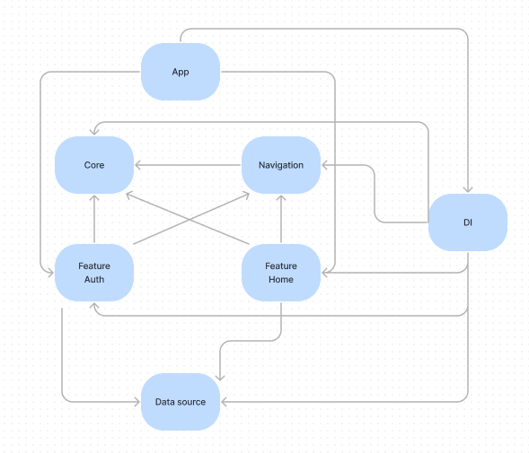
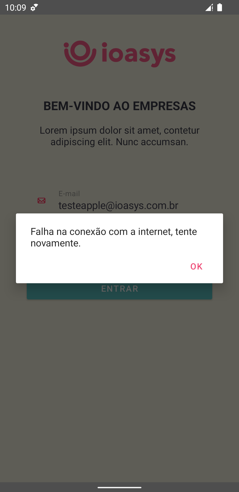

App do desafio da empresa ioasys (https://bitbucket.org/ioasys/empresas-android/src/master/).

##

Composto por 3 telas:

1. Tela de login: Foram tratados os casos de erro em que o email e a senha foram inválidos. Foi utilizado o padrão OAuth 2.0 e no caso de sucesso do login a api retornou 3 custom headers (access-token, uid, client). Usuário: testeapple@ioasys.com.br / Senha: 12341234;

2. Tela de listagem das empresas: Nessa tela foi feita uma requisição para obter a lista de empresas e utilizado uma endpoint para filtrar a mesma. Foram utilizados os headers obtidos da tela anterior para autenticar essa requisição;

3. Tela de descrição de uma empresa: Nessa tela são exibidos em detalhe as informações de uma empresa clicada na lista da tela anterior.

##

Principais bibliotecas utilizadas:
- Gerenciamento de estado: ViewModel, Coroutines
- Requisições api REST: Retrofit
- Download de imagens: Glide
- Injeção de dependência: Koin
- Testes unitários: JUnit4 e Mockk
- Compose 

##

Módulos:
- App
- Core
- Navigation
- DI
- Feature Auth
- Feature Home
- Data source

##

            